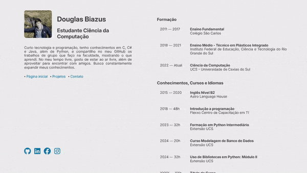

# Portfolio Website

Projeto de  site de portfólio desenvolvido em Flask, com exibição de formações, cursos, projetos e informações de contato (WhatsApp, telefone e e-mail).

- **Formações**: Exibe informações sobre ensino.
- **Cursos e Certificações**: Destaca os cursos e certificações relevantes ao seu perfil.
- **Projetos**: Apresentar projetos com descrição, linguagens utilizadas e links. (GitHub, site de demonstração, ...)
- **Informações de Contato**: Exibir opções de contato, WhatsApp, telefone e e-mail, redes sociais.


- **Backend**: Flask (Python) e Jinja2 para templates.
- **Frontend**: HTML, CSS, JS (Efeitos de fade-in e scroll suave)

---
**Demo:**



---

**Como Executar o Projeto**

1. **Clone o repositório**:
```bash
git clone https://github.com/douglasb78/douglasb_website.git
```

2. **Crie um venv e instale os requisitos**
```bash
python -m venv venv
pip install -r requirements.txt
```

2. **Execute app.py**
```bash
python -m app
```


